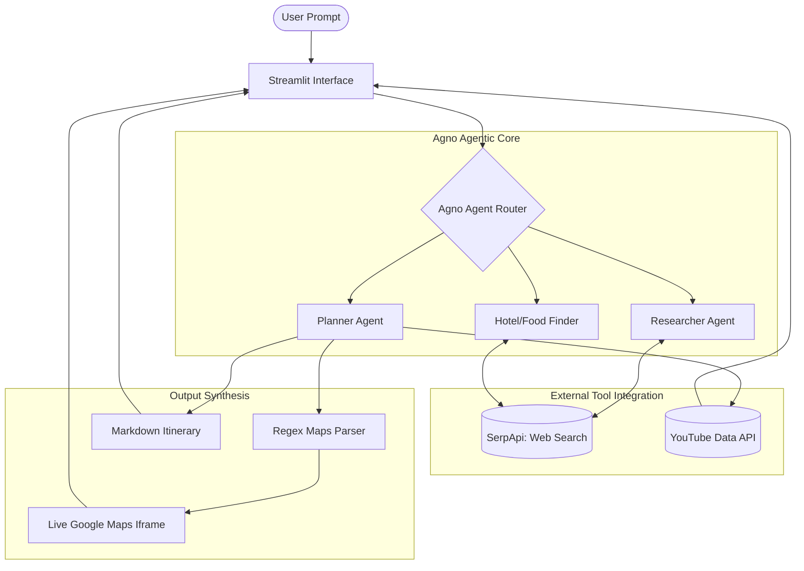
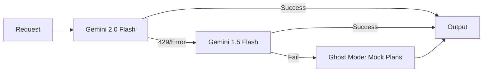

# 🌿 Green Trails: Premium AI-Orchestrated Travel Ecosystem

Green Trails is a state-of-the-art, mobile-first travel platform that leverages multi-agentic AI architectures to deliver hyper-personalized travel itineraries, real-time flight data, interactive mapping, and peer-to-peer sharing capabilities.

---

## 🚀 Core Features

- **📍 AI Travel Planner:** Orchestrates end-to-end journeys including flights, detailed itineraries, and YouTube experiences.
- **💬 Travel Concierge (AI Assistant):** A real-time conversational agent capable of deep research, dietary-aware food suggestions, and live route mapping.
- **🏡 Home Share:** Premium peer-to-peer property listing and booking system with host metadata transparency.
- **🚕 Ride Share:** Smart carpooling module allowing users to post and book rides with integrated booking logs.
- **🛡️ Admin Dashboard:** Real-time metrics and global system oversight for administrators.

---

## 🛠️ Technical Tech Stack

### **Frontend & Backend Framework**
- **Framework:** [Streamlit](https://streamlit.io/) - Used as a unified framework for both the reactive UI and the server-side logic, enabling rapid, stateful web application development.
- **Styling:** Custom Vanilla CSS with **Glassmorphism** aesthetics. Implemented a "Green-Yellow-White" premium design system with `Fade-In-Up` animations and Outfit Typography.

### **Artificial Intelligence & Agents**
- **Agent Framework:** [Agno (formerly Phidata)](https://www.agno.com/) - Powers the multi-agent system.
- **Core LLMs:** 
  - **Google Gemini 2.0 Flash:** Primary model for high-speed, tool-enabled reasoning.
  - **Google Gemini 1.5 Flash:** Reliable secondary model for the "Model Ladder" fallback system.
- **Agentic Architecture:**
  - **Researcher Agent:** Specializes in destination deep-dives and safety insights.
  - **Planner Agent:** Designs logical daily itineraries and optimizes routes.
  - **Hotel & Restaurant Finder:** Specialized in rating-based searches and dietary-specific recommendations.

### **APIs & Integration**
- **SerpApi:** Integrated for real-time **Google Flights** data and **Google Search** (via `SerpApiTools`).
- **YouTube Data API v3:** Powers the dynamic video recommendation engine.
- **Google Maps:** Embedded interactive frames via Google Maps Embed API.
- **Streamlit Authenticator:** Secure `bcrypt` based user authentication and session management.

---

## 🧠 System Architecture & Algorithms

### **1. Agentic Workflow (Agno Powered)**

The following diagram illustrates how the Agno framework orchestrates multi-agent communication and tool execution:



### **2. The "Model Ladder" Fallback Architecture**

This flow ensures high availability even during API rate limits:



### **3. Data Processing Logic**
- **Multi-Agent Orchestration:** The system employs a decentralized agent model where specific tasks (Research, Planning, Sourcing) are delegated to specialized agents. These agents utilize **Recursive Tool-Use** to search the web, parse results, and synthesize a cohesive plan.

### **2. The "Model Ladder" Fallback Algorithm**
To ensure 99.9% uptime, the app implements a model ladder:
1. Attempt execution with `Gemini 2.0 Flash`.
2. If `RateLimit (429)` or `ResourceExhausted` occurs, immediately pivot to `Gemini 1.5 Flash`.
3. If all API quotas are exhausted, the **"Ghost Mode" (Offline Fallback)** algorithm activates, fetching expert-verified mock data from the `MOCK_PLANS` repository indexed by Geo-location.

### **3. YouTube Recommendation Engine**
The recommendation logic uses search-string optimization:
- It reformats user destination queries into a "Vlog/Itinerary" structured query.
- Uses a **Ranked Result Parsing** algorithm to filter high-view, relevant travel videos.
- Displays results in a responsive grid using Streamlit's container system.

### **4. Interactive Map Embedding**
Maps are integrated via a custom Regex Parser:
- The system scans AI-generated text for `[Map](URL)` patterns.
- It extracts the `query` parameter and reconstructs a secure **Google Maps Iframe**.
- These are injected as `st.components.v1.iframe` objects for real-time interaction.

---

## ⚙️ Installation & Setup

1. **Clone the repository:**
   ```bash
   git clone <repo-url>
   cd ai-travel-planner
   ```

2. **Install Dependencies:**
   ```bash
   pip install -r requirements.txt
   ```

3. **Environment Configuration:**
   Create a `.env` file in the root directory:
   ```env
   GOOGLE_API_KEY=your_gemini_key
   SERPAPI_KEY=your_serpapi_key
   YOUTUBE_API_KEY=your_youtube_key
   ```

4. **Run the Application:**
   ```bash
   streamlit run app.py
   ```

---

## 🔒 Security & Privacy
- **Password Hashing:** Uses `bcrypt` for secure credential storage.
- **Session Isolation:** Streamlit `session_state` ensures user data remains private within the current session.
- **API Guard:** Environment variables are strictly loaded via `python-dotenv` to prevent key exposure.

---
*Built with ❤️ by Aravind & The Green Trails Team.*
